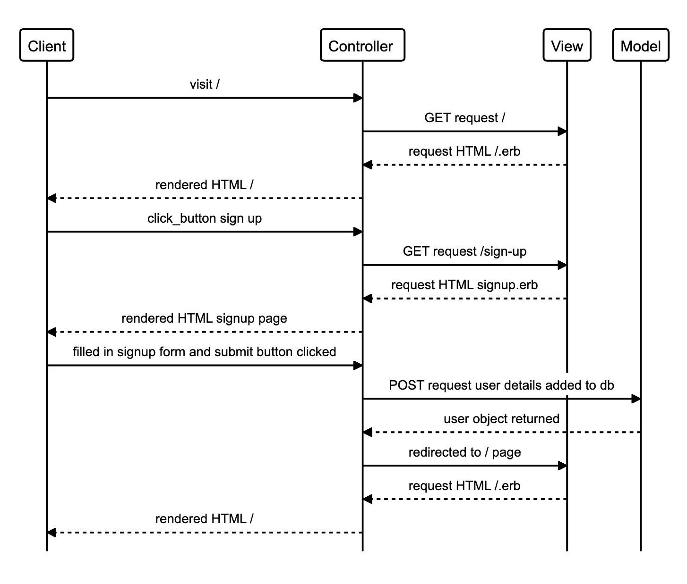
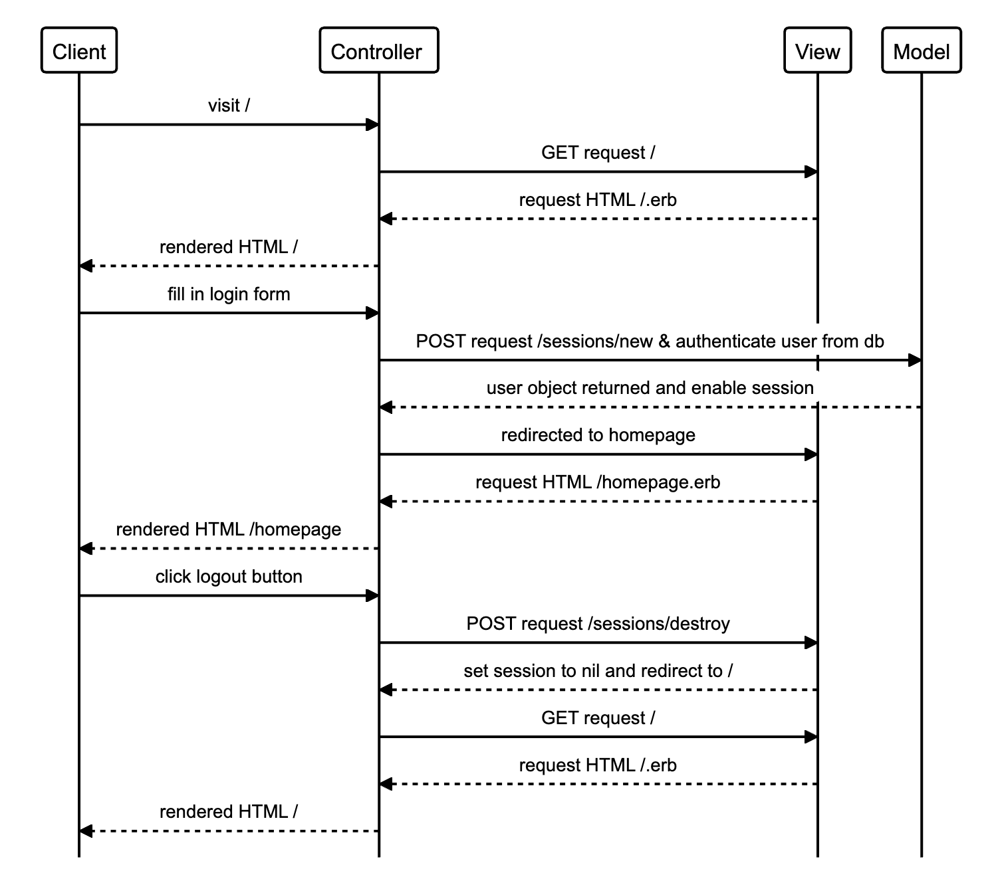
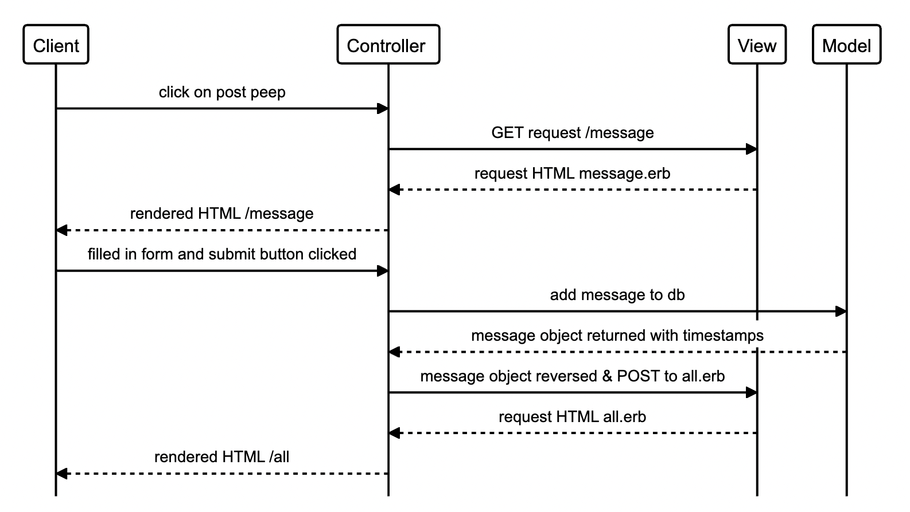

## Chitter Challenge in Ruby

Re-create a clone of Twitter in Ruby to ensure I am ready for the applier's stage in the job hunter process

<p>&nbsp;</p>

## User Stories
```
As a Maker
So that I can let people know what I am doing  
I want to post a message (peep) to chitter
```
```
As a maker
So that I can see what others are saying  
I want to see all peeps in reverse chronological order
```
```
As a Maker
So that I can better appreciate the context of a peep
I want to see the time at which it was made
```
```
As a Maker
So that I can post messages on Chitter as me
I want to sign up for Chitter
```
```
As a Maker
So that only I can post messages on Chitter as me
I want to log in to Chitter
```
```
As a Maker
So that I can avoid others posting messages on Chitter as me
I want to log out of Chitter
```
<p>&nbsp;</p>

### Domain Model
<details>
<summary> Users can create an account  </summary>
<br>

</details>

<details>
<summary> Users can log in and log out </summary>
<br>

</details>

<details>
<summary> Users can create a peep and get it to show in reverse chronological order with a timestamp </summary>
<br>

</details>

<p>&nbsp;</p>

## Tech Stack
Frontend
* HTML
* CSS
  
Backend
* Ruby
* Sinata Web Framework
* PostgresSQL
  
Testing
* RSpec
* Capybara
<p>&nbsp;</p>

## How to install and run

<br>

### Project Setup
```
git clone
```
```
bundle
```
<br>

### Database Setup
To create the database and the tables run
```
rake setup
```
### Run App
App is hosted on localhost/9292. Run ```rackup``` and vist localhost/9292 on your selected browser

<br>

### Run Tests
```
rspec
```
<br>

### Run Linting
```
rubocop
```
<p>&nbsp;</p>

## User Interface Flow
<details>
<summary> Sign Up </summary>
add image here
<br>
</details>

<details>
<summary> Login </summary>
add image here
<br>
</details>

<details>
<summary> Create a Peep </summary>
add image here
show timestamp
<br>
</details>

<details>
<summary> Logout </summary>
add image here
<br>
</details>

## 1st Attempt
Click [here](https://github.com/tiffanyvallo/chitter-challenge) to view my original attempt creating Chitter